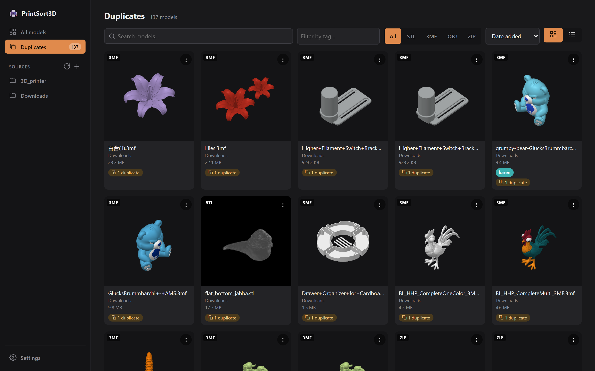

# PrintSort3D

A local web app for cataloging, browsing, and searching your STL / 3MF / OBJ / ZIP print files. Scans folders you point it at, generates a thumbnail for each model (extracted directly from Bambu Lab `.3mf` files, or rendered in-browser for everything else), and lets you tag and take notes on each file.

See [docs/architecture.md](docs/architecture.md) for how it's built, [docs/api.md](docs/api.md) for the HTTP API, and [docs/testing.md](docs/testing.md) for the test suites.


## Features

- **Scans folders you configure** — recursively finds `.stl`, `.3mf`, `.obj`, and `.zip` files under any number of watched roots. Files that disappear are flagged "missing" (keeping their tags/notes), not deleted, and un-flagged if they reappear.
- **A thumbnail for every model** — pulled straight out of Bambu Lab `.3mf` files, or rendered in-browser with three.js for STL/OBJ and non-Bambu 3MFs, then cached server-side.
- **Interactive 3D viewer** — orbit/pan/zoom, drawn against a to-scale build plate (parsed per-file for Bambu/Orca 3MFs, otherwise a configurable default). Loads a server-baked binary mesh so even multi-megabyte models open near-instantly; a **Load full model** button re-parses the source file in-browser on demand.
- **Multi-plate 3MFs** — switch between plates, or view them all laid out on their own beds. Plate names from Bambu Studio / OrcaSlicer are shown.
- **Painted / multi-material colors** — per-triangle filament assignments from AMS 3MFs are decoded and rendered in the viewer.
- **Folder navigation** — the sidebar shows a collapsible folder tree under each source with per-folder counts; the file page shows a clickable path breadcrumb.
- **Tags & notes** — free-form tags (with colors) and notes per file, filterable from the library.
- **Duplicate detection** — exact byte matches (SHA-256) and order/rounding-tolerant geometry hashing, surfaced as a dedicated Duplicates view and per-file list.
- **Slicer metadata** — filament type/color, layer height, and the raw settings blob extracted from 3MFs.
- **`.zip` archive browsing** — lists and previews 3D model files inside archives without extracting them.

| Folder tree & path breadcrumb | Per-file detail & 3D viewer |
|---|---|
|  |  |
| **Painted / multi-material colors** | **Duplicate detection** |
|  |  |

## Requirements

- Node.js 22.5+ (the server uses the built-in `node:sqlite` module — no native build tools needed)
- Windows, macOS, or Linux

## Setup

From the repo root:

```sh
npm run install:all
```

This installs dependencies for the root, `server/`, and `client/` packages.

## Running it

```sh
npm run dev
```

This starts both halves of the app together:

- **Server** — Express API on `http://localhost:3001`
- **Client** — Vite dev server on `http://localhost:5173` (proxies `/api` to the server)

Open `http://localhost:5173` in your browser.

On first run, the server creates `server/config.json` (empty root list) and `server/catalog.db` (SQLite). Go to the **Settings** page in the app to add folders you want scanned, then click **Rescan now**.

## Building for production

```sh
npm run build --prefix server
npm run build --prefix client
```

- `server/dist/index.js` — compiled server; run with `node server/dist/index.js` (serves the API only; put a static file server or reverse proxy in front for the built client if you want a single deployable unit)
- `client/dist/` — static client build

## Running tests

```sh
npm test
```

Runs the server test suite (Vitest + Supertest) and the client test suite (Vitest) back to back. See [docs/testing.md](docs/testing.md) for details, or run each package's tests individually with `npm test --prefix server` / `npm test --prefix client`.

## Project layout

```
server/   Express + TypeScript API, SQLite catalog, filesystem scanner
client/   React + TypeScript frontend (Vite), three.js viewer/thumbnails
docs/     Architecture, API reference, and testing docs
```
