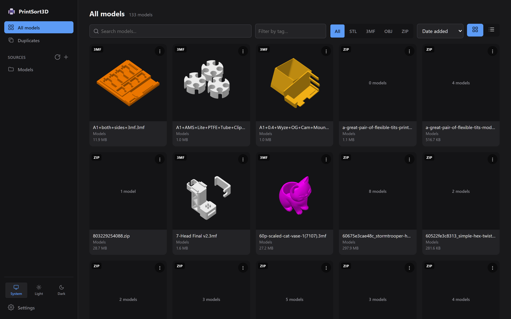
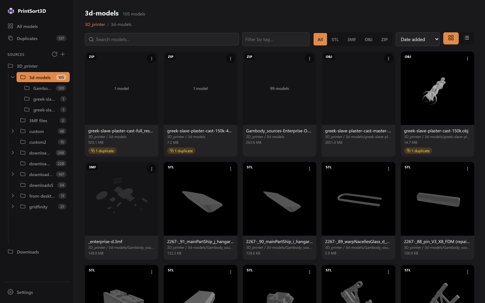
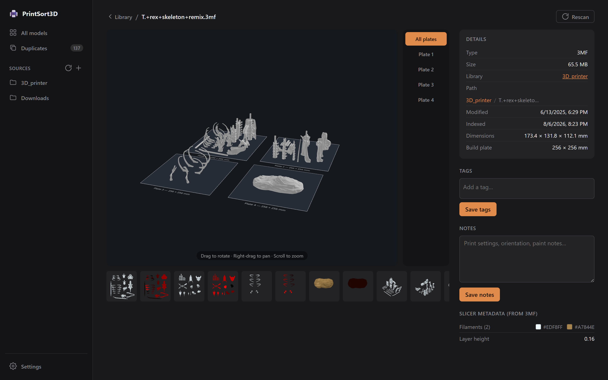
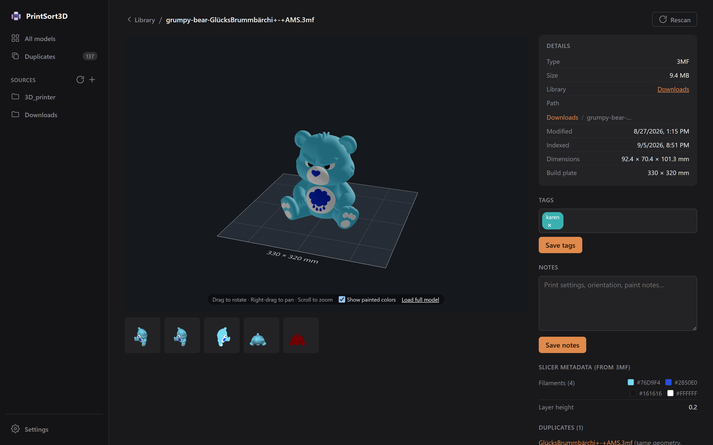

# PrintSort3D

A local web app for cataloging, browsing, and searching your STL / 3MF / OBJ / ZIP / F3D print files. Scans folders you point it at, generates a thumbnail for each model (extracted directly from Bambu Lab `.3mf` and Fusion 360 `.f3d` files, rendered server-side for everything else), and lets you tag and take notes on each file.

See [docs/architecture.md](docs/architecture.md) for how it's built, [docs/api.md](docs/api.md) for the HTTP API, [docs/testing.md](docs/testing.md) for the test suites, and [docs/backlog.md](docs/backlog.md) for deferred work.



## Features

- **Scans folders you configure** — recursively finds `.stl`, `.3mf`, `.obj`, `.zip`, and `.f3d` (Fusion 360) files under any number of watched roots. Files that disappear are flagged "missing" (keeping their tags/notes), not deleted, and un-flagged if they reappear.
- **A thumbnail for every model** — pulled straight out of Bambu Lab `.3mf` files, or rendered in-browser with three.js for STL/OBJ and non-Bambu 3MFs, then cached server-side.
- **Interactive 3D viewer** — orbit/pan/zoom, drawn against a to-scale build plate (parsed per-file for Bambu/Orca 3MFs, otherwise a configurable default). Loads a server-baked binary mesh so even multi-megabyte models open near-instantly; a **Load full model** button re-parses the source file in-browser on demand.
- **Multi-plate 3MFs** — switch between plates, or view them all laid out on their own beds. Plate names from Bambu Studio / OrcaSlicer are shown.
- **Painted / multi-material colors** — per-triangle filament assignments from AMS 3MFs are decoded and rendered in the viewer.
- **Folder navigation** — the sidebar shows a collapsible folder tree under each source with per-folder counts; the file page shows a clickable path breadcrumb.
- **Tags & notes** — free-form tags (with colors) and notes per file, filterable from the library.
- **Duplicate detection** — exact byte matches (SHA-256) and order/rounding-tolerant geometry hashing, surfaced as a dedicated Duplicates view and per-file list.
- **Slicer metadata** — filament type/color, layer height, and the raw settings blob extracted from 3MFs.
- **Print estimates** — print time, filament weight/length, printer model and supports, read from a Bambu/Orca 3MF's `slice_info.config` and shown on each file (with badges in the grid). Sort the library by print time or filament used.
- **`.zip` archive browsing** — lists and previews 3D model files inside archives without extracting them.

| Folder tree & path breadcrumb | Per-file detail & 3D viewer |
|---|---|
|  |  |

**Painted / multi-material colors** — per-triangle AMS filament assignments decoded from the 3MF and rendered in the viewer:



## Requirements

- Node.js 22.5+ (the server uses the built-in `node:sqlite` module — no native build tools needed)
- Windows, macOS, or Linux

## Setup

From the repo root:

```sh
npm run install:all
```

This installs dependencies for the root, `server/`, and `client/` packages.

## Running it

```sh
npm run dev
```

This starts both halves of the app together:

- **Server** — Express API on `http://localhost:3001`
- **Client** — Vite dev server on `http://localhost:5173` (proxies `/api` to the server)

Open `http://localhost:5173` in your browser.

On first run, the server creates `server/config.json` (empty root list) and `server/catalog.db` (SQLite). Go to the **Settings** page in the app to add folders you want scanned, then click **Rescan now**.

## Exposing it beyond localhost

The server binds `127.0.0.1` by default and has **no authentication** — it's built for local
use. To reach it from another machine, set `HOST=0.0.0.0` and put access control in front:

| Env var | Effect |
|---|---|
| `PRINTSORT_PASSWORD` | Require HTTP Basic auth on every request (the browser prompts). |
| `PRINTSORT_READONLY=1` | Reject every catalogue edit — browsing only. |
| `PRINTSORT_ROOTS_LOCKED=1` | Forbid changing the watched-folder list via the API. |
| `PRINTSORT_CORS_ORIGINS` | Comma-separated origin allowlist, if a browser app on another origin needs the API. |

The Docker image sets `HOST=0.0.0.0`, but [`docker-compose.yml`](docker-compose.yml) publishes
the port on loopback only (`127.0.0.1:3001:3001`) until you opt in. See
[docs/api.md](docs/api.md#access-control) for details.

## Running in Docker

One self-contained image — the Node server serves the API **and** the built client on port
`3001`, so there's nothing else to run. Works on Linux and on Docker Desktop for Windows/macOS.

Every folder mounted under `/models/<name>` is registered as a source and scanned on startup,
so the library is populated the moment the container is up — no Settings step. All mutable
state (catalog, tags, notes, caches) lives in the `/data` volume.

### Use the published image

The image is published to GitHub Container Registry as `ghcr.io/amospainter/printsort3d`.
The [`docker-compose.yml`](docker-compose.yml) in the repo root already points at it:

```sh
MODELS_DIR=/path/to/your/print/files docker compose up -d
```

Open `http://localhost:3001`. Later, `docker compose pull && docker compose up -d` gets the
newest image. Without compose (note the loopback-only port bind — drop the `127.0.0.1:` and
set `PRINTSORT_PASSWORD` to expose it on your LAN):

```sh
docker run -d --name printsort3d -p 127.0.0.1:3001:3001 -v printsort3d-data:/data -v /path/to/your/print/files:/models/prints:ro --restart unless-stopped ghcr.io/amospainter/printsort3d:latest
```

### Build your own image

```sh
docker build -t printsort3d .
```

Then use `printsort3d` in place of `ghcr.io/amospainter/printsort3d:latest` in the `docker run`
above — or, for compose, comment out the `image:` line in [`docker-compose.yml`](docker-compose.yml),
uncomment `build: .`, and run `docker compose up -d --build`.

See [docs/docker.md](docs/docker.md) for multiple folders, persistent volumes, Windows paths,
upgrades, and publishing new image versions.

## Building for production

```sh
npm run build --prefix server
npm run build --prefix client
```

- `server/dist/index.js` — compiled server; run with `node server/dist/index.js`
- `client/dist/` — static client build

If a built client is found next to the server (`../client/dist`, or wherever `CLIENT_DIST`
points), the server serves it — API and UI on one port, no reverse proxy needed. This is
how the Docker image runs. Without a build present (dev), Vite serves the client and proxies
`/api` to the server.

## Running tests

```sh
npm test
```

Runs the server test suite (Vitest + Supertest) and the client test suite (Vitest) back to back. See [docs/testing.md](docs/testing.md) for details, or run each package's tests individually with `npm test --prefix server` / `npm test --prefix client`.

## Project layout

```
server/   Express + TypeScript API, SQLite catalog, filesystem scanner
client/   React + TypeScript frontend (Vite), three.js viewer/thumbnails
docs/     Architecture, API reference, testing docs, and the deferred-work backlog
```
